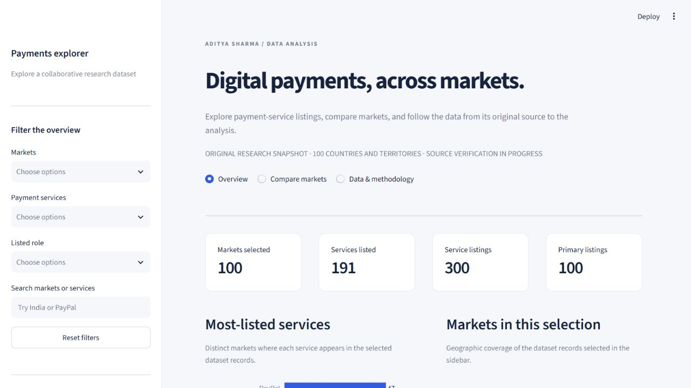
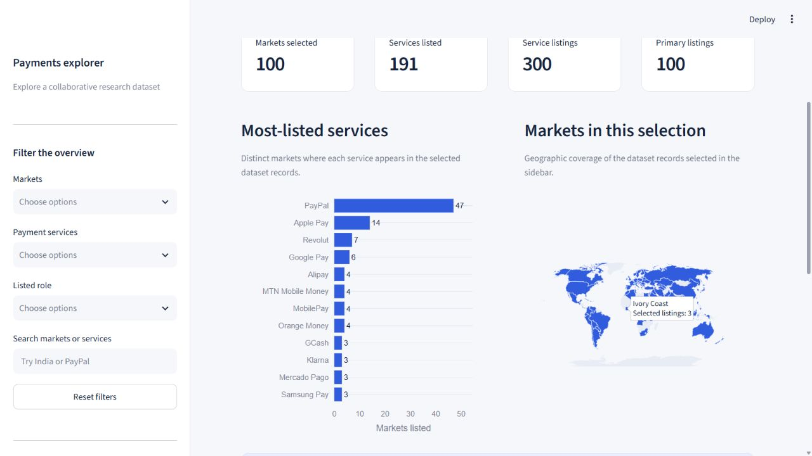

# Digital Payments Explorer

A collaborative payments research project, rebuilt into an interactive explorer with Python, SQL, Excel and Power BI. Explore **300 service listings across 100 countries and territories**, compare the main service and alternatives recorded for each market, and inspect every cleaning decision.



**What this dataset measures:** mentions of payment services in the original research table. It includes wallets, payment networks and payment schemes. It does not contain transactions, customer records, payment volumes or dated adoption measurements. Original market-share values remain explicitly **unverified** and are excluded from analytical rankings.



## Explore the project

| Deliverable | What you can do |
| --- | --- |
| [Interactive dashboard](streamlit_app.py) | Filter markets, services and listed roles; search; compare up to three markets; download selections |
| [Excel analysis](outputs/payments-analysis/Digital-Payments-Analysis.xlsx) | Change the market selector, explore a native chart and formula-based service coverage, and add source evidence |
| [Power BI report](outputs/payments-analysis/Digital-Payments-Explorer.pbix) | Open a populated three-page report with overview metrics, market comparison and data review |
| [Editable Power BI project](powerbi/Digital-Payments-Explorer.pbip) | Review the report definitions, relationships, Power Query snapshot and DAX measures |
| [SQL analysis](sql/analysis.sql) | Reproduce coverage, role-mix, market-comparison and evidence checks against the included SQLite database |
| [Findings](docs/findings.md) | Read the conclusions and their practical limits |

The dashboard currently runs locally. The Excel and Power BI files can be downloaded and opened independently.

## A few findings

- The source has **100 market records**, each with one main service and two alternatives: **300 listings** and **191 service entries** after documented name cleaning.
- **PayPal appears in 47 distinct market records**: two as the main service and 45 as an alternative. This is coverage in the dataset, not a market-share or availability claim.
- **M-Pesa appears twice in Tanzania's row.** Both original roles are preserved, the record is flagged for review, and country coverage counts Tanzania once.
- Cleaning records **9 name corrections** and **302 URL-format changes**. Formatting a link does not verify its content or whether it is still active.
- All **100 original market-share values** lack documented primary sources, observation periods and measurement definitions. The research queue makes that gap visible.

## Run the dashboard

Use Python **3.10 or newer**; development and validation used Python **3.12**. Power BI and Excel are optional for the Python dashboard.

```sh
git clone https://github.com/Aditya-6446/Ecommerce_Payments_Analysis.git
cd Ecommerce_Payments_Analysis
python -m venv .venv
```

Activate the environment:

```powershell
# Windows PowerShell
.venv\Scripts\Activate.ps1
```

```sh
# macOS / Linux
source .venv/bin/activate
```

Then install and launch:

```sh
python -m pip install -r requirements.txt
python prepare_data.py
python -m streamlit run streamlit_app.py
```

The original `streamlit run Profiling.py` command is retained as a compatibility entry point.

## Reproduce the analysis

```sh
python prepare_data.py
python -m pip install -r requirements-dev.txt
python -m pytest -q
```

Preparation writes the normalized CSV tables, a summary and `data/processed/payments.sqlite`. The SQL queries in `sql/analysis.sql` run against that database. The tests check source reconciliation, service identities, duplicate-aware coverage, URL preservation, filtering, SQLite results and dashboard interactions.

The workbook and PBIX are release snapshots. Re-running data preparation does not silently overwrite those files. See the [update guide](docs/update-guide.md) before changing the source or rebuilding the Power BI model.

## Data and design

```text
data/raw/payments.csv       Preserved original research snapshot
data/processed/             Prepared tables, SQLite database and audit trail
src/payments.py             Cleaning, validation, filtering and coverage logic
streamlit_app.py            Interactive dashboard
sql/analysis.sql            Reproducible analytical queries
outputs/payments-analysis/  Excel workbook and populated Power BI report
powerbi/                   Editable Power BI project and embedded data model
tests/                     Data and application checks
docs/                      Findings, methodology, schema and update guide
```

Read the [methodology](docs/methodology.md) and [data dictionary](docs/data-dictionary.md) for definitions, source traceability and identity decisions. The root `Test.csv` and `EDA_Report.html` are retained as original project artifacts; the HTML is the legacy profiling output.

## Credits and contact

The original data collection was a collaborative project. This repository presents that research with documented cleaning, reproducible analysis and interactive outputs. The original source does not record a collection date or contributor-by-contributor provenance.

[Aditya Sharma's portfolio](https://aditya-6446.github.io/portfolio/) · [GitHub](https://github.com/Aditya-6446) · [Email](mailto:aditya12421@gmail.com)

Code is provided under the [MIT License](LICENSE). Linked third-party material retains its own terms.
